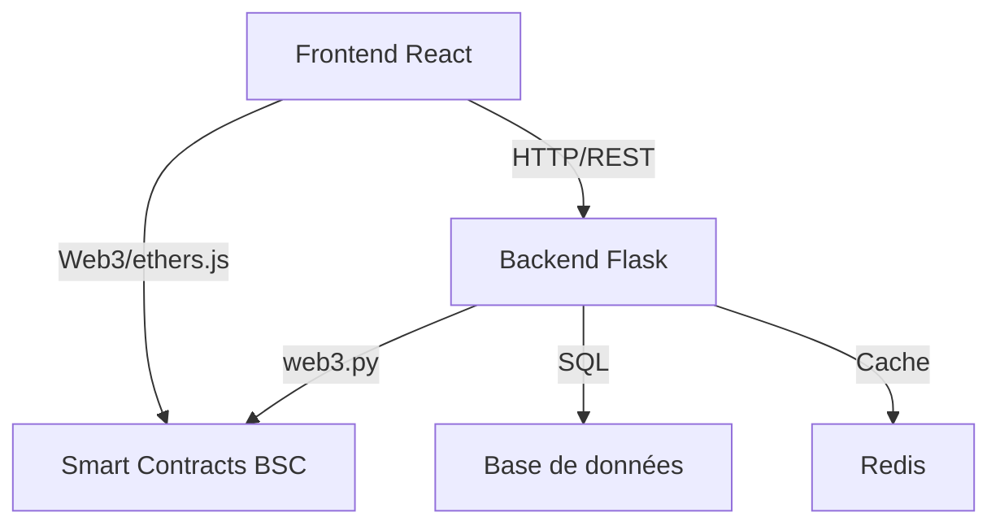

# Documentation Technique - Green Hash Maroc 🌿

## 📖 Présentation Générale

Green Hash Maroc est une plateforme Web3 innovante qui combine minage de cryptomonnaies écologique et développement durable au Maroc. Le projet utilise une architecture moderne en trois couches :

- **Frontend** : Application React/Vite pour l'interface utilisateur
- **Backend** : API Flask pour la logique métier
- **Blockchain** : Smart contracts sur BSC pour les tokens et le staking

### Architecture Globale



## 🎨 Frontend

### Technologies
- React 18.2.0
- Vite 4.2.0
- ethers.js 5.7.2
- TailwindCSS 3.2.7

### Structure
```
frontend/
├── src/
│   ├── components/    # Composants réutilisables
│   ├── pages/        # Pages de l'application
│   ├── context/      # Context Web3 et états globaux
│   ├── hooks/        # Custom hooks React
│   └── utils/        # Fonctions utilitaires
```

### Fonctionnalités Principales
- Connection wallet (Web3Modal/MetaMask)
- Dashboard de minage
- Interface de staking
- Échange de tokens
- Simulateur de rentabilité

## ⚙️ Backend

### Technologies
- Python 3.11
- Flask 3.0.3
- SQLAlchemy 2.0.25
- PostgreSQL (production)
- Redis (cache/queue)

### API Endpoints

#### Mining
```
GET  /api/mining/test     # Test de connexion
POST /api/mining/calculate    # Calcul de rentabilité
GET  /api/mining/stats       # Statistiques globales
```

#### Pool
```
GET  /api/pool/info      # Info staking pool
POST /api/pool/stake     # Staking de tokens
POST /api/pool/unstake   # Unstaking de tokens
```

#### Prices
```
GET  /api/prices/token   # Prix GREENHASH
GET  /api/prices/btc     # Prix Bitcoin
```

### Modèles de Données
- MiningCalculation
- StakingPosition
- Transaction
- UserProfile

## 🔗 Smart Contracts

### GreenHashToken (ERC20)
- Token principal de la plateforme
- Implements: ERC20, Burnable, Pausable, Permit

### GreenStakingPool
- Gestion du staking
- APR variable
- Verrouillage configurable

### Événements
```solidity
event Staked(address indexed user, uint256 amount)
event Unstaked(address indexed user, uint256 amount)
event RewardPaid(address indexed user, uint256 reward)
```

## 🛠 Environnement de Développement

### Prérequis
- Node.js 18.0.0+
- Python 3.11+
- Git
- Docker & Docker Compose

### Configuration BSC Testnet
- Network ID: 97
- RPC: https://data-seed-prebsc-1-s1.binance.org:8545/
- Explorer: https://testnet.bscscan.com

## 🔒 Bonnes Pratiques

### Sécurité
- Validation stricte des inputs
- Rate limiting sur l'API
- Authentification JWT
- Vérification des signatures Web3

### Performance
- Cache Redis pour les données blockchain
- Queue Celery pour les calculs lourds
- Indexes PostgreSQL optimisés

### Maintenance
- Tests automatisés
- CI/CD via GitHub Actions
- Monitoring Sentry
- Logging structuré

## 📈 Monitoring et Métriques

### Points de Surveillance
- Temps de réponse API
- Taux de succès transactions
- Utilisation mémoire/CPU
- Latence blockchain

### Alertes
- Erreurs API > 1%
- Temps réponse > 500ms
- Échec synchronisation blockchain
- Utilisation mémoire > 80%